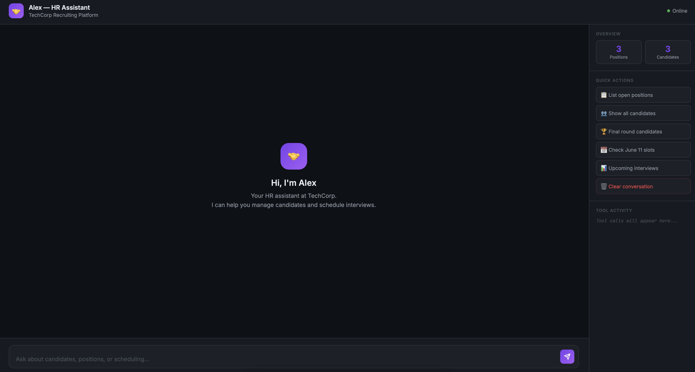
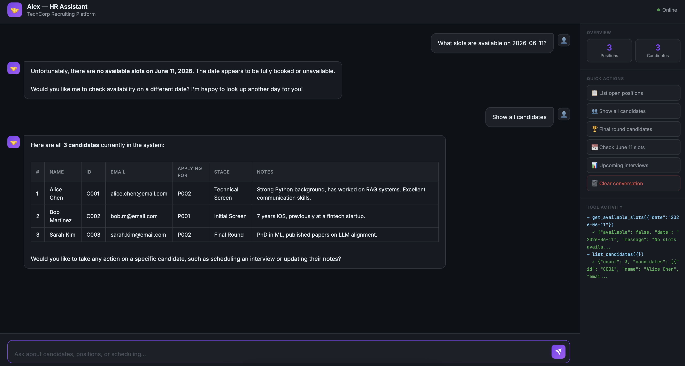

# HR Interview Scheduling Agent

An AI-powered HR assistant built with the **Anthropic Claude API**. Demonstrates real agentic behavior — tool use, the ReAct loop, session persistence, and a full web UI — built from scratch in Python.


---

## What It Does

A recruiter can chat with Alex — the HR agent — in plain English to:

- Browse open positions and their requirements
- Look up candidate profiles and pipeline stages
- Check calendar availability for interview slots
- Book interviews and update candidate notes
- Resume previous conversations across sessions

---

## How it looks





___


## Architecture

```
┌─────────────────────────────────────────────────┐
│                   Interfaces                     │
│         Web UI (Flask)    CLI (Rich)             │
└──────────────────┬──────────────────────────────┘
                   │
┌──────────────────▼──────────────────────────────┐
│                 Agent Loop                       │
│                                                  │
│   User message → Claude API → stop_reason?       │
│                     │                            │
│              tool_use │ end_turn                 │
│                     │        │                   │
│            Run tool  │    Return text            │
│            Feed result back ↑                    │
└──────────────────┬──────────────────────────────┘
                   │
┌──────────────────▼──────────────────────────────┐
│                  Tool Layer                      │
│                                                  │
│   list_open_positions    get_candidate           │
│   list_candidates        get_available_slots     │
│   book_interview         update_candidate_notes  │
│   list_upcoming_interviews                       │
└──────────────────┬──────────────────────────────┘
                   │
┌──────────────────▼──────────────────────────────┐
│               Data Layer (JSON)                  │
│    positions.json  candidates.json  calendar.json│
└─────────────────────────────────────────────────┘
```

---

## Project Structure

```
hr-agent/
├── agent/                  # Core agent logic
│   ├── loop.py             # Agent loop + ReAct pattern
│   ├── tools.py            # Tool definitions (JSON schemas)
│   └── handlers.py         # Tool implementations
├── web/                    # Web interface
│   ├── server.py           # Flask routes
│   ├── templates/
│   │   └── index.html      # Chat UI
│   └── static/
│       ├── style.css
│       └── app.js
├── data/                   # Runtime data
│   ├── positions.json
│   ├── candidates.json
│   ├── calendar.json
│   └── sessions/           # Saved conversation sessions
├── tests/
│   └── test_handlers.py
├── app.py                  # Web entry point
├── cli.py                  # CLI entry point
├── session_manager.py      # Session persistence
└── conftest.py
```

---

## Setup

**1. Clone and create a virtual environment:**
```bash
git clone https://github.com/hellensoloviy/hr-agent.git
cd hr-agent
python3 -m venv venv
source venv/bin/activate
```

**2. Install dependencies:**
```bash
pip install -r requirements.txt
```

**3. Add your Anthropic API key:**
```bash
cp .env.example .env
# Edit .env and add your key from console.anthropic.com
```

**4. Run:**
```bash
# Web UI
python3 app.py
# → Open http://localhost:5001

# CLI
python3 cli.py
```

---

## Usage

### Web UI

Open `http://localhost:5001` after running `python3 app.py`.

Use the quick action buttons in the sidebar or type naturally:

```
"What positions are currently open?"
"Tell me about Alice Chen"
"Who's in the final round?"
"What slots are available on June 11th?"
"Book Alice for the 11am slot on June 11th"
```

The **Tool Activity** panel shows every tool call the agent makes in real time — useful for understanding how the agent loop works.

### CLI

```bash
python3 cli.py
```

Supports session persistence — previous conversations can be resumed on restart.

---

## Running Tests

```bash
pytest tests/
```

---

## Key Concepts Demonstrated

**Tool Use / Function Calling**
The model never executes code directly. It returns a structured `tool_use` block signalling intent — name and arguments. The application runs the actual function and feeds the result back. This is what separates an agent from a chatbot.

**The Agent Loop (ReAct Pattern)**
```
while stop_reason == "tool_use":
    run the requested tool
    append result to history
    call the API again

# stop_reason == "end_turn" → return response to user
```
Each iteration is a Reason → Act → Observe cycle. The loop exits only when the model has everything it needs to answer.

**Stateless LLMs**
The model has no memory between API calls. The application maintains the full conversation history and passes it with every request. The model sees the complete transcript each time — this is how context is preserved.

**External Memory**
Persistent state lives in the data layer (JSON files), not in the model. Tools read and write this layer directly. In production this would be a database with proper auth and retention policies.

**Context Window Management**
Long conversations are trimmed to stay within the context window — keeping the first exchange (for anchoring) and the most recent N turns.

**Session Persistence**
Conversations are serialized to JSON and can be resumed across restarts. Each session captures the full message history including tool call blocks.

---

## Production Considerations

This project is a working prototype. For production:

| Area | Current | Production |
|---|---|---|
| Data layer | JSON files | PostgreSQL / DynamoDB |
| Sessions | JSON files | Database with retention policy |
| Auth | None | Per-user scoping with JWT |
| History | Global in-memory | Per-session, server-side |
| Context management | Hard trim | Summarization + semantic retrieval |
| Error handling | Basic retry | Full observability + alerting |
| Calendar | Mock slots | Google Calendar API |

---

## Built With

- [Anthropic Python SDK](https://github.com/anthropics/anthropic-sdk-python) — Claude API
- [Flask](https://flask.palletsprojects.com/) — Web server
- [Rich](https://github.com/Textualize/rich) — CLI formatting
- [python-dotenv](https://github.com/theskumar/python-dotenv) — Environment config
- [pytest](https://pytest.org/) — Tests